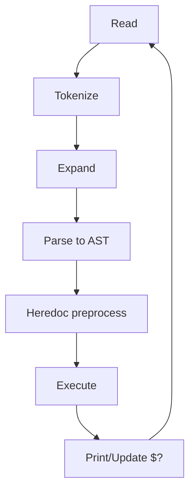
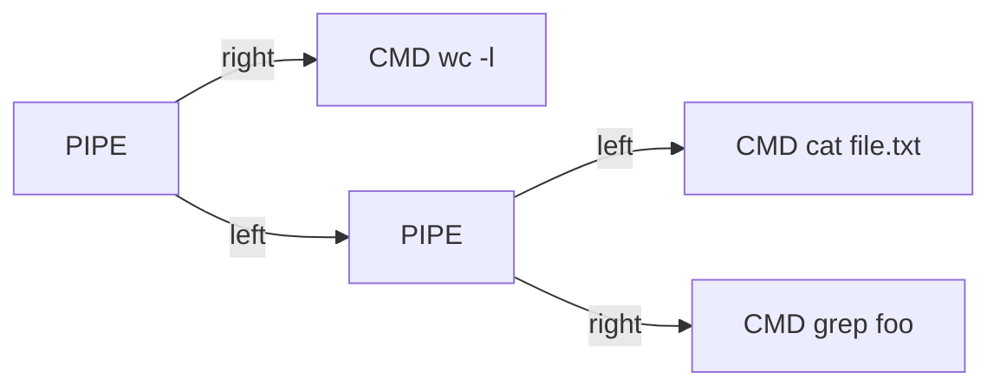
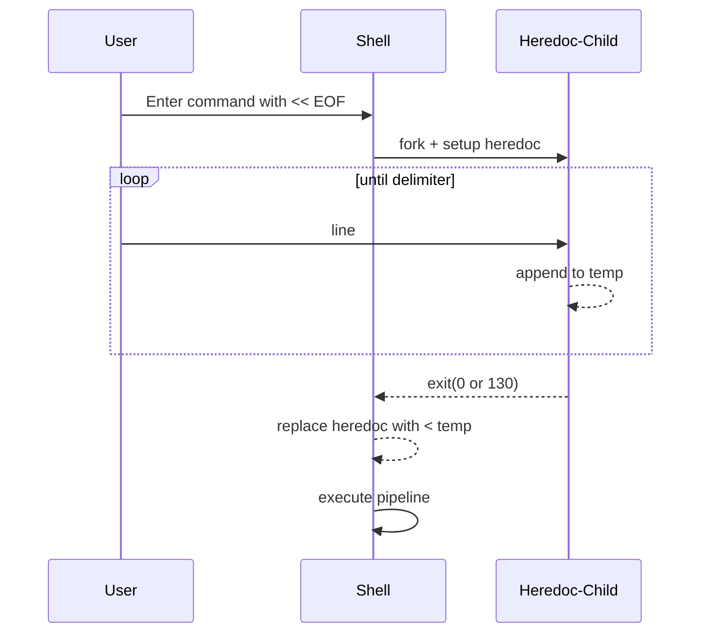
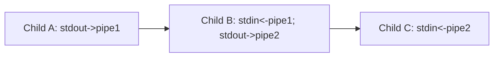

# Minishell — Conceptual Guide

This guide explains the core concepts of the minishell project, with examples, diagrams, and step-by-step flows. It complements the full logic guide in `MINISHELL_FLOW.md` by focusing on the “why” and “how” at a conceptual level.

## Table of Contents

- What is a Shell?
- What is a REPL?
- Environment Variables
- Tokens, Words, and Operators
- Quoting Rules
- Expansion: \$VAR, $?, $$ and Globbing
- AST (Abstract Syntax Tree)
    - Building the AST from tokens
    - Visual examples (increasing complexity)
    - Step-by-step execution over the AST
    - Child processes and status propagation
- Redirections (<, >, >>, <<)
- Heredoc (<<)
    - Behavior, signals, expansion rules
    - Example with diagrams
- Pipelines (|)
- Logical Operators (&& and ||)
- Builtins Overview
- Signals: Interactive vs Execution
- Error Handling and Exit Status

---

## What is a Shell?

A shell is a program that provides a command-line interface to the operating system. The user types commands, the shell interprets them, executes them (either internally or by spawning other programs), and prints results.

---

## What is a REPL?

REPL stands for Read–Evaluate–Print–Loop.

- Read: Get a line of input from the user.
- Evaluate: Tokenize, expand variables, parse to an AST, and execute it.
- Print: Show command output or errors; translate child statuses.
- Loop: Repeat until the user exits (or EOF is reached).

In minishell:
- Read uses readline with history and editing.
- Evaluate performs tokenization → expansion → parsing → heredoc preprocessing → execution.
- Print includes command output and signal messages (e.g., Ctrl+C effects).
- Loop runs until the `exit` builtin or Ctrl+D at an empty prompt.

Overview:


---

## Environment Variables

Environment variables are key–value pairs inherited by processes. Common ones:
- PATH: Colon-separated directories used to locate executables.
- HOME: User’s home directory.
- PWD/OLDPWD: Current and previous working directories.
- SHLVL: Shell nesting level, incremented on startup.

Examples:
```sh
$ echo $HOME
/home/user

$ echo $PATH
/usr/local/bin:/usr/bin:/bin
```

Minishell maintains an internal copy of the environment, which builtins like `export` and `unset` can modify.

---

## Tokens, Words, and Operators

During tokenization, the input line is split into a sequence of tokens:
- WORD: Unquoted/quoted strings (command names and arguments)
- Operators: `|`, `||`, `&&`, `<`, `>`, `>>`, `<<`, `(`, `)`, and EOF

Whitespace separates tokens, except inside quotes.

---

## Quoting Rules

- Single quotes '...': Literal. No expansions occur inside.
- Double quotes "...": Parameter expansion allowed; wildcard expansion is typically disabled.
- Unquoted: Both parameter expansion and wildcard expansion may occur.

Examples:
```sh
$ echo '$HOME'     # prints literally: $HOME
$ echo "$HOME"     # prints the value of HOME
$ echo *.c         # expands to matching files, if any
```

---

## Expansion: \$VAR, $?, $$ and Globbing

- `$VAR` or `${VAR}` → value from the environment
- `$?` → last command’s exit status
- `$$` → current shell’s PID
- Globbing: `*` matches files (subject to quoting rules)

Example:
```sh
$ echo pid=$$ status=$?
pid=12345 status=0
```

If a wildcard doesn’t match files, it remains literal (depending on policy).

---

## AST (Abstract Syntax Tree)

The parser transforms tokens into a tree reflecting operator precedence and grouping:
- Highest precedence: Parentheses `(...)`
- Redirections bind to the nearest simple command
- Pipeline `|` chains commands left-to-right
- Logical operators `&&` and `||` combine pipelines (left-to-right) with short-circuiting

### Building the AST from tokens (conceptually)

1. Parse a `logical_expr`: pipeline ( (&& or ||) pipeline )*
2. Parse a `pipeline`: command ( | command )*
3. Parse a `command`: sequence of WORDs, redirects, and parenthesized sub-commands

### Visual examples (increasing complexity)

1) Simple command
```
Input:   echo hello
AST:     [CMD echo [args: hello]]
```

2) Command with redirections
```
Input:   grep foo < in.txt > out.txt
AST:
    [CMD grep [args: foo]
         redir_in:  < in.txt
         redir_out: > out.txt]
```

3) Pipeline
```
Input:   cat file.txt | grep foo | wc -l
AST:
    [PIPE
         left:  [PIPE
                             left:  [CMD cat [args: file.txt]]
                             right: [CMD grep [args: foo]]]
         right: [CMD wc   [args: -l]]]
```

4) Logical operators
```
Input:   make && ./program || echo "failed"
AST:
    [OR
         left:  [AND
                             left:  [CMD make]
                             right: [CMD ./program]]
         right: [CMD echo [args: failed]]]
```

5) Parentheses and mixed
```
Input:   (echo start && false) || (echo A | tr A a)
AST:
    [OR
        left:  [SUBSHELL
                            [AND
                                 left:  [CMD echo [args: start]]
                                 right: [CMD false]]]
        right: [SUBSHELL
                            [PIPE
                                 left:  [CMD echo [args: A]]
                                 right: [CMD tr   [args: A a]]]]]
```

Mermaid AST for the pipeline example:


### Step-by-step execution over the AST

Example: `cat file | grep foo && echo ok || echo fail`

1. Evaluate pipeline: `cat file | grep foo`
     - Create pipe, fork two children.
     - Child 1: dup pipe-write to STDOUT, exec `cat file`.
     - Child 2: dup pipe-read to STDIN, exec `grep foo`.
     - Parent: close pipe ends; wait for both; pipeline’s status = status of last command (`grep`).
2. If pipeline status == 0, run `echo ok`; else skip it.
3. If previous status != 0, run `echo fail`.

Status propagation uses the last executed node return value; `$?` reflects that.

### Child processes and status propagation

- External commands and pipelines: executed in forked children.
- Builtins:
    - In parent when standalone (so they can modify the shell state: cd, export, unset, exit).
    - In a child when inside pipelines or subshells.
- Status translation:
    - Normal exit → exit code (0–255)
    - Killed by signal → 128 + signal number (e.g., SIGINT → 130)

---

## Redirections (<, >, >>, <<)

Applied to the nearest command node:
- `< file`  → open file read-only and dup to STDIN
- `> file`  → create/truncate file and dup to STDOUT
- `>> file` → create/append file and dup to STDOUT
- `<< delim` → heredoc; see next section

Errors (like permissions) abort the command with a non-zero status.

---

## Heredoc (<<)

Heredoc reads input lines until the delimiter line is seen, storing content in a temporary file used as STDIN for the target command.

Key points:
- Signal behavior: Ctrl+C during heredoc aborts the heredoc and returns to prompt with status 130.
- Expansion: If the delimiter is quoted, parameter expansion inside the heredoc content is disabled.
- Implementation often forks a helper process to collect input with special signal handlers.

Example:
```
Command: cat <<EOF | grep hello
hello world
bye
EOF
```
Flow:
1. Preprocess heredoc: collect lines until `EOF` into a temporary file.
2. Replace `<< EOF` with `< /tmp/.hdN` in the command’s redirections.
3. Execute pipeline `cat < /tmp/.hdN | grep hello`.

Diagram:
```
[stdin] --(heredoc collector)--> [/tmp/.hdN]
[/tmp/.hdN] --(dup to STDIN of cat)--> cat | grep hello
```

Mermaid heredoc flow:


---

## Pipelines (|)

Pipelines connect STDOUT of one command to STDIN of the next using pipes and forks.

Example execution of `A | B | C`:
1. Create 2 pipes.
2. Fork child A: dup pipe1.write → STDOUT; exec A.
3. Fork child B: dup pipe1.read → STDIN; dup pipe2.write → STDOUT; exec B.
4. Fork child C: dup pipe2.read → STDIN; exec C.
5. Parent closes all pipe fds and waits. The pipeline exit status = status of C.

Mermaid pipeline layout:


---

## Logical Operators (&& and ||)

- `X && Y`: Evaluate Y only if X returned 0.
- `X || Y`: Evaluate Y only if X returned non-zero.

Short-circuiting ensures the right-hand side may not run.

---

## Builtins Overview

- echo: prints arguments; supports multiple `-n` flags in a row
- cd: changes directory; updates PWD/OLDPWD; handles errors
- pwd: prints current directory
- export: sets environment variables; with no args, prints sorted environment
- unset: removes variables
- env: prints environment
- exit: exits the shell; validates numeric argument and argument count

Parent vs child execution:
- Parent: cd/export/unset/exit standalone to affect shell state
- Child: builtins within pipelines/subshells

---

## Signals: Interactive vs Execution

Interactive (main loop):
- SIGINT (Ctrl+C): interrupt current input line, print newline, show prompt
- SIGQUIT (Ctrl+\\): typically ignored

Execution (children):
- Default signal dispositions; SIGINT and SIGQUIT produce messages and affect status (130, 131)

Heredoc: custom SIGINT handler to exit collector with 130.

---

## Error Handling and Exit Status

Common messages and statuses:
- Syntax error near token → status 2
- Command not found → status 127
- Permission denied / is a directory → status 126
- Redirection open errors → status 1 (commonly)
- Signal termination → 128 + signal

`$?` always reflects the last completed command or pipeline at the prompt.

---
