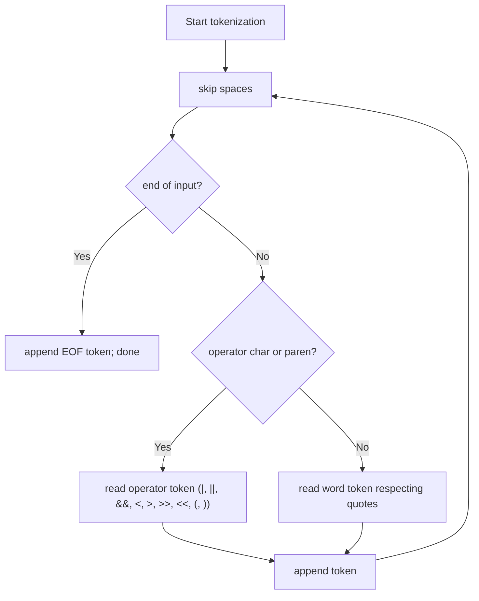
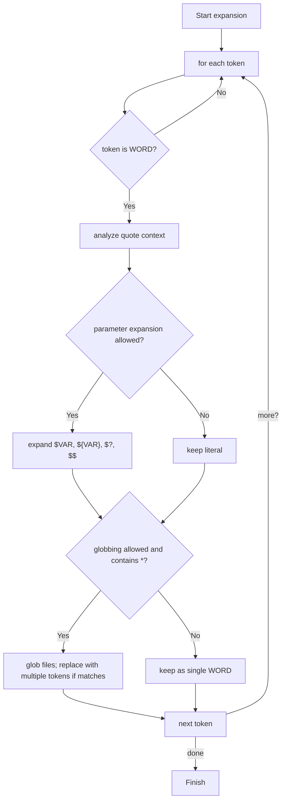
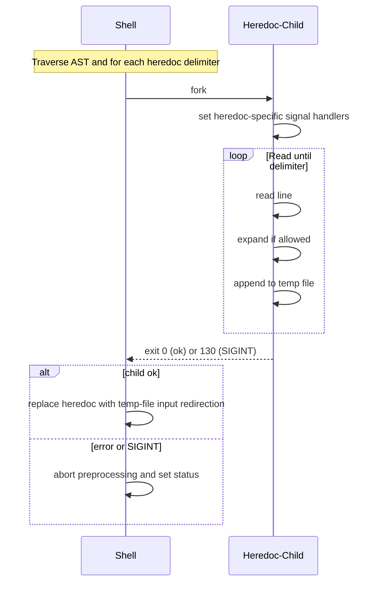
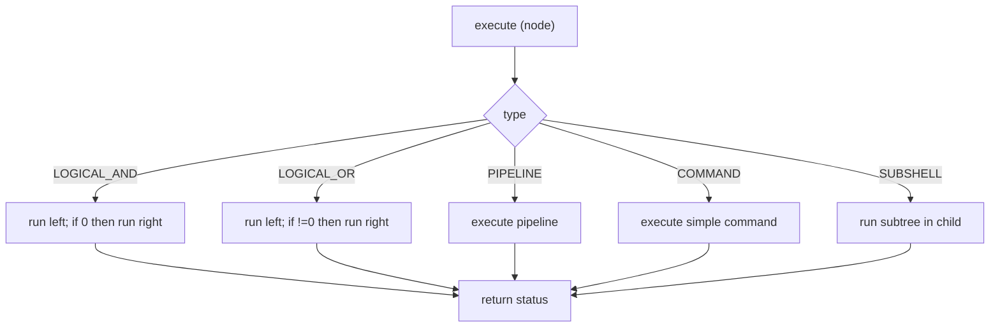
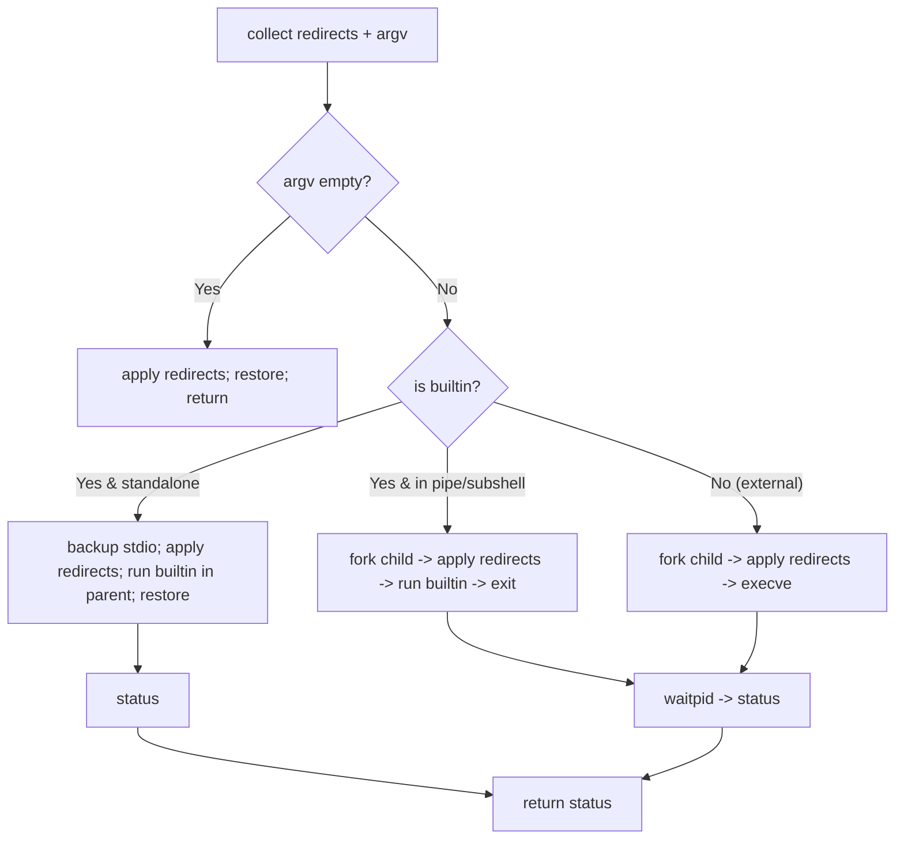
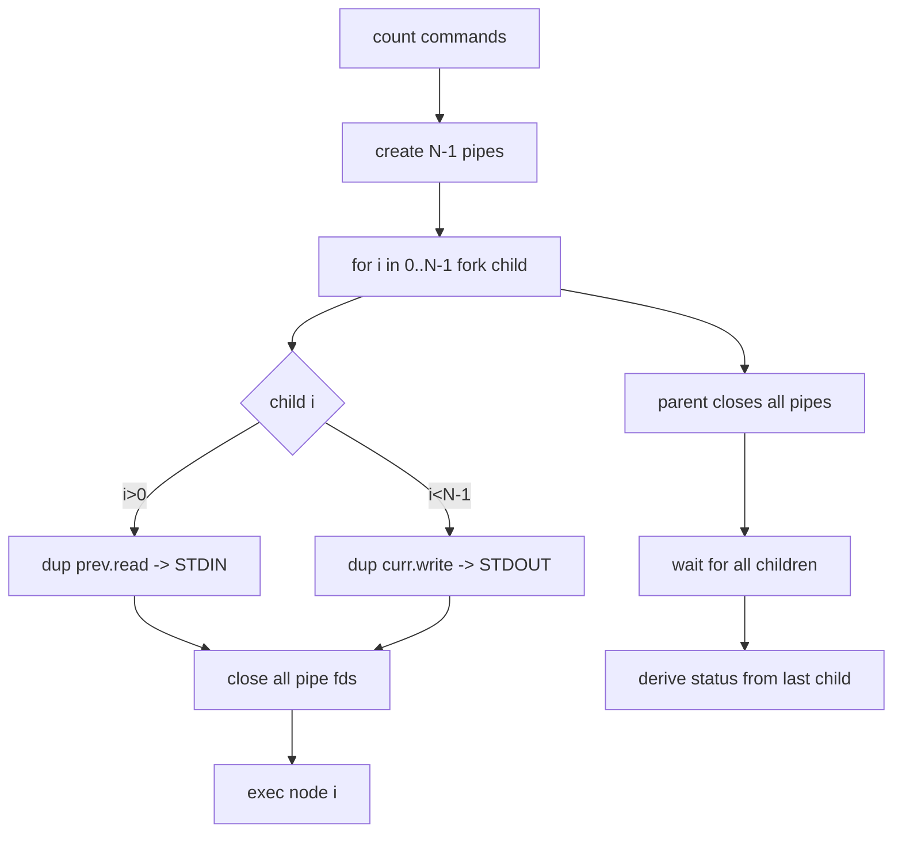
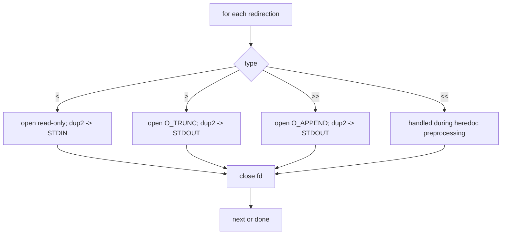
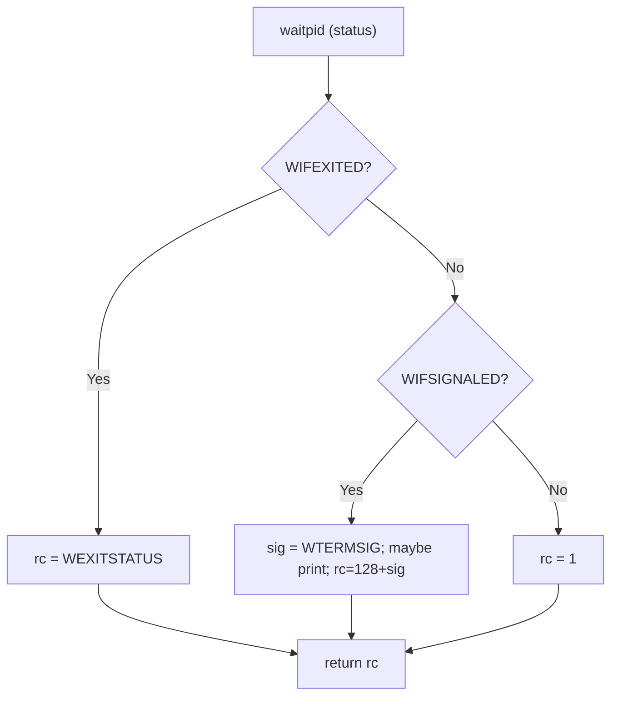

# Minishell Flowcharts

These flowcharts reflect the minishell logic from input to execution, including tokenization, expansion, parsing/AST, heredoc preprocessing, and execution (commands, pipelines, logical operators), as well as redirections and child status translation.

---

## 1) Main REPL Loop

```mermaid
flowchart TD
    A[Start minishell] --> B[Init context, env copy, signals]
    B --> C{readline #40;prompt#41;}
    C -->|NULL &#40;EOF&#41;| Z[print &quot;exit&quot;; return last status]
    C --> D{empty/space only?}
    D -->|Yes| C
    D -->|No| E{Needs multiline?}
    E -->|Yes| F[read continuation lines]
    F -->|Canceled/EOF| C
    E -->|No| G[tokenize #40;line#41;]
    G --> H{tokenization ok?}
    H -->|No| C
    H -->|Yes| I[expand #40;tokens#41;]
    I --> J[parse #40;tokens#41;-&gt;AST]
    J --> K{parse ok and at EOF?}
    K -->|No| C
    K -->|Yes| L[preprocess heredocs #40;AST#41;]
    L --> M{ok?}
    M -->|No #40error/SIGINT#41| C
    M -->|Yes| N[status = execute #40;AST#41;]
    N --> O[ctx.#36;? = status]
    O --> C
```

---

## 2) Tokenizer

Notes:
- Quotes are preserved in WORD tokens for later expansion decisions.

---

## 3) Expansion

---

## 4) Parser (Recursive Descent)

```mermaid
flowchart TD
    A[parse&#40;tokens&#41;] --> B[parse_logical_expr]
    B --> C{next is &amp;&amp; or #124;#124;?}
    C -->|Yes| D[build AND/OR node; parse next pipeline]
    C -->|No| E[return pipeline]
    D --> C

    subgraph Pipeline
        P1[parse_pipeline] --> P2[parse_command]
    P2 --> P3{next is #124; ?}
        P3 -->|Yes| P4[build PIPE node; parse next command]
        P3 -->|No| P5[return command]
        P4 --> P3
    end

    subgraph Command
        C1[start simple command]
        C1 --> C2{next token}
        C2 -->|WORD| C3[append arg]
    C2 -->|REDIR| C4[parse redirect: &lt;, &gt;, &gt;&gt;, &lt;&lt; + WORD]
    C2 -->| | C5[parse parenthesis -&gt; SUBSHELL]
        C2 -->|other| C6[stop]
        C3 --> C2
        C4 --> C2
        C5 --> C2
    end

    E --> F{at EOF?}
    F -->|No| G[error: leftover tokens; cleanup and fail]
    F -->|Yes| H[return AST]
```

---

## 5) Heredoc Preprocessing

---

## 6) Execution — Node Dispatcher

### 6.a) Execute Simple Command

### 6.b) Execute Pipeline

---

## 7) Redirections Apply

---

## 8) Child Status Translation and Signals

---

These diagrams match the behavior described in `MINISHELL_FLOW.md` and `CONCEPTUAL_GUIDE.md`.