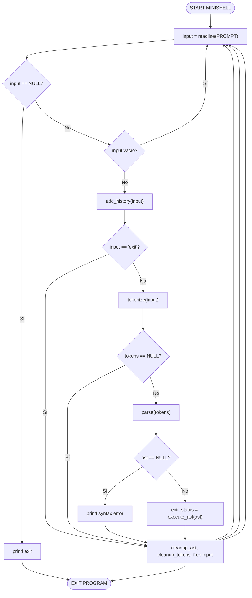
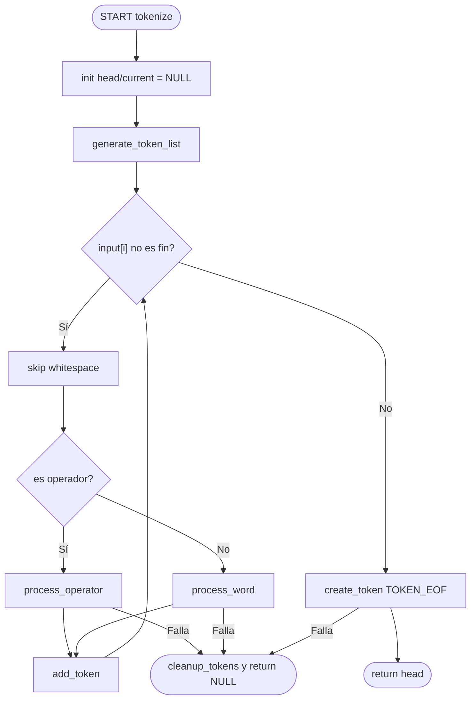
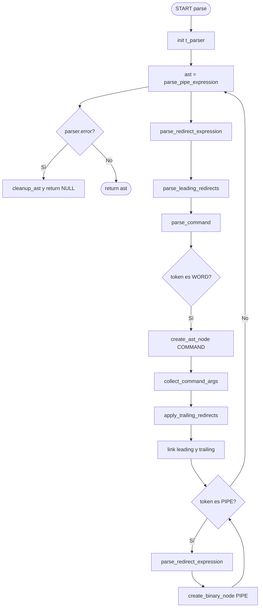
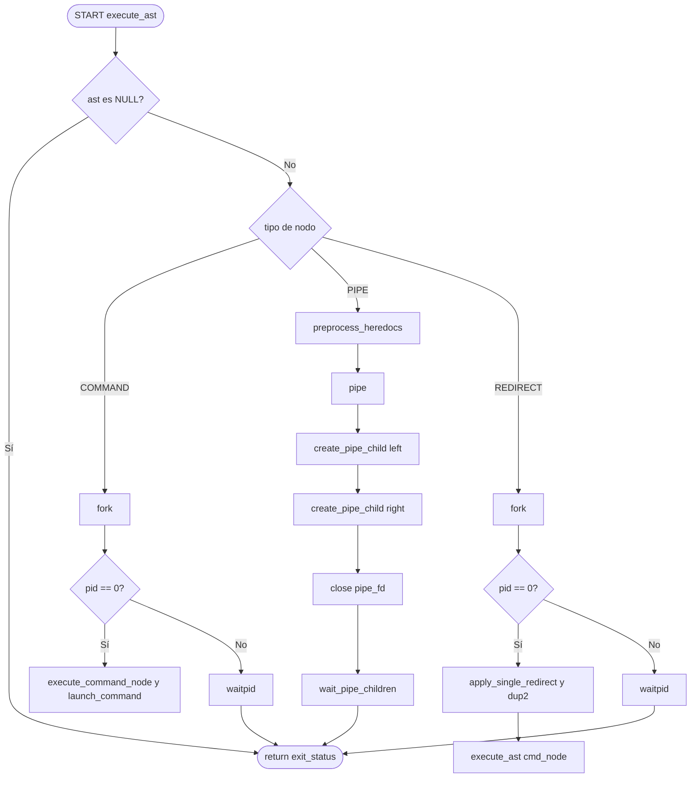

# Diagramas de Flujo - Minishell

## Diagrama Principal

```mermaid
flowchart TD
    START([START MINISHELL])
    INPUT["input = readline(PROMPT)"]
    NULL_CHECK{"input == NULL?"}
    EMPTY_CHECK{"input vacío?"}
    HISTORY["add_history(input)"]
    EXIT_CHECK{"input == 'exit'?"}
    TOKENIZE["tokenize(input)"]
    TOKEN_ERROR{"tokens == NULL?"}
    PARSE["parse(tokens)"]
    PARSE_ERROR{"ast == NULL?"}
    EXECUTE["exit_status = execute_ast(ast)"]
    CLEANUP["cleanup_ast, cleanup_tokens, free input"]
    EXIT_PROGRAM([EXIT PROGRAM])
    PRINT_EXIT_MSG["printf exit"]
    SYNTAX_ERROR["printf syntax error"]

    START --> INPUT
    INPUT --> NULL_CHECK
    NULL_CHECK -- Sí --> PRINT_EXIT_MSG --> EXIT_PROGRAM
    NULL_CHECK -- No --> EMPTY_CHECK
    EMPTY_CHECK -- Sí --> INPUT
    EMPTY_CHECK -- No --> HISTORY
    HISTORY --> EXIT_CHECK
    EXIT_CHECK -- Sí --> CLEANUP --> EXIT_PROGRAM
    EXIT_CHECK -- No --> TOKENIZE
    TOKENIZE --> TOKEN_ERROR
    TOKEN_ERROR -- Sí --> CLEANUP --> INPUT
    TOKEN_ERROR -- No --> PARSE
    PARSE --> PARSE_ERROR
    PARSE_ERROR -- Sí --> SYNTAX_ERROR --> CLEANUP --> INPUT
    PARSE_ERROR -- No --> EXECUTE
    EXECUTE --> CLEANUP
    CLEANUP --> INPUT
```

## Tokenizer Detallado

```mermaid
flowchart TD
    %% Proceso de tokenización

    TOK_START([START tokenize])
    TOK_INIT["init head/current = NULL"]
    GEN_LIST[generate_token_list]
    ADD_EOF["create_token TOKEN_EOF"]
    TOK_SUCCESS([return head])
    TOK_ERROR(["cleanup_tokens y return NULL"])

    LOOP{"input[i] no es fin?"}
    SKIP_WS[skip whitespace]
    IS_OP{"es operador?"}
    PROC_OP[process_operator]
    PROC_WORD[process_word]
    ADD_TOKEN[add_token]

    TOK_START --> TOK_INIT --> GEN_LIST
    GEN_LIST --> LOOP
    LOOP -- Sí --> SKIP_WS --> IS_OP
    IS_OP -- Sí --> PROC_OP
    IS_OP -- No --> PROC_WORD
    PROC_OP --> ADD_TOKEN
    PROC_WORD --> ADD_TOKEN
    PROC_OP -- Falla --> TOK_ERROR
    PROC_WORD -- Falla --> TOK_ERROR
    ADD_TOKEN --> LOOP
    LOOP -- No --> ADD_EOF
    ADD_EOF -- Falla --> TOK_ERROR
    ADD_EOF --> TOK_SUCCESS
```

## Parser Detallado (Descenso Recursivo)

```mermaid
flowchart TD
    %% Parser por descenso recursivo

    PAR_START([START parse])
    PAR_INIT[init t_parser]
    CALL_PIPE_EXPR["ast = parse_pipe_expression"]
    CHECK_ERR{"parser.error?"}
    CLEANUP_AST["cleanup_ast y return NULL"]
    PAR_SUCCESS([return ast])

    CALL_REDIR_EXPR[parse_redirect_expression]
    PIPE_LOOP{"token es PIPE?"}
    CALL_REDIR_EXPR_RIGHT[parse_redirect_expression]
    CREATE_PIPE["create_binary_node PIPE"]

    PARSE_LEADING_REDIRS[parse_leading_redirects]
    CALL_PARSE_CMD[parse_command]
    APPLY_TRAILING_REDIRS[apply_trailing_redirects]
    LINK_REDIRS_TO_CMD[link leading y trailing]

    IS_WORD_TOKEN{"token es WORD?"}
    CREATE_CMD_NODE["create_ast_node COMMAND"]
    COLLECT_CMD_ARGS[collect_command_args]

    PAR_START --> PAR_INIT --> CALL_PIPE_EXPR
    CALL_PIPE_EXPR --> CHECK_ERR
    CHECK_ERR -- Sí --> CLEANUP_AST
    CHECK_ERR -- No --> PAR_SUCCESS

    CALL_PIPE_EXPR --> CALL_REDIR_EXPR
    CALL_REDIR_EXPR --> PARSE_LEADING_REDIRS
    PARSE_LEADING_REDIRS --> CALL_PARSE_CMD
    CALL_PARSE_CMD --> IS_WORD_TOKEN
    IS_WORD_TOKEN -- Sí --> CREATE_CMD_NODE --> COLLECT_CMD_ARGS --> APPLY_TRAILING_REDIRS
    APPLY_TRAILING_REDIRS --> LINK_REDIRS_TO_CMD --> PIPE_LOOP
    PIPE_LOOP -- Sí --> CALL_REDIR_EXPR_RIGHT --> CREATE_PIPE --> PIPE_LOOP
    PIPE_LOOP -- No --> CALL_PIPE_EXPR
```

## Executor Detallado

```mermaid
flowchart TD
    %% Recorrido del AST por el ejecutor

    EX_START([START execute_ast])
    EX_CHECK{"ast es NULL?"}
    NODE_TYPE{tipo de nodo}
    RETURN_STATUS([return exit_status])

    CMD_FORK[fork]
    CMD_CHILD{"pid == 0?"}
    CMD_EXEC["execute_command_node y launch_command"]
    CMD_WAIT[waitpid]

    PIPE_HDOC[preprocess_heredocs]
    PIPE_PIPE[pipe]
    PIPE_L_CHILD["create_pipe_child left"]
    PIPE_R_CHILD["create_pipe_child right"]
    PIPE_CLOSE[close pipe_fd]
    PIPE_WAIT[wait_pipe_children]

    REDIR_FORK[fork]
    REDIR_CHILD{"pid == 0?"}
    REDIR_APPLY["apply_single_redirect y dup2"]
    REDIR_EXEC["execute_ast cmd_node"]
    REDIR_WAIT[waitpid]

    EX_START --> EX_CHECK
    EX_CHECK -- Sí --> RETURN_STATUS
    EX_CHECK -- No --> NODE_TYPE

    NODE_TYPE -- COMMAND --> CMD_FORK
    CMD_FORK --> CMD_CHILD
    CMD_CHILD -- Sí --> CMD_EXEC
    CMD_CHILD -- No --> CMD_WAIT --> RETURN_STATUS

    NODE_TYPE -- PIPE --> PIPE_HDOC --> PIPE_PIPE --> PIPE_L_CHILD --> PIPE_R_CHILD --> PIPE_CLOSE --> PIPE_WAIT --> RETURN_STATUS

    NODE_TYPE -- REDIRECT --> REDIR_FORK
    REDIR_FORK --> REDIR_CHILD
    REDIR_CHILD -- Sí --> REDIR_APPLY --> REDIR_EXEC
    REDIR_CHILD -- No --> REDIR_WAIT --> RETURN_STATUS
```