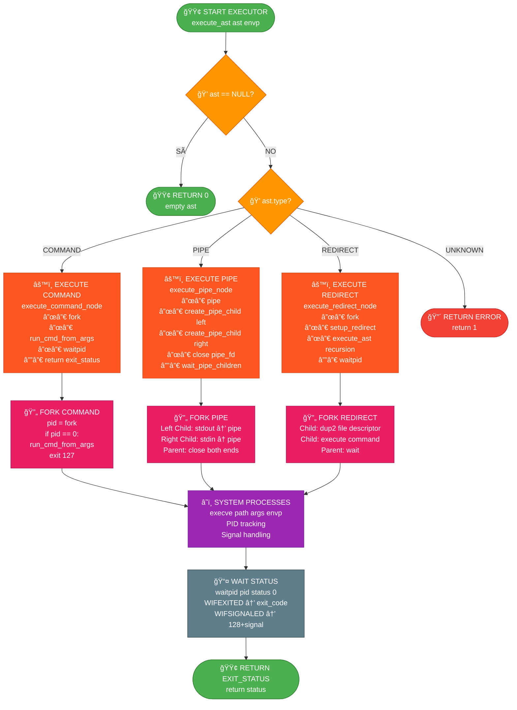

# Diagramas de Flujo - Minishell

## Diagrama Principal

```mermaid
flowchart TD
    START([🟢 START MINISHELL<br/>main loop])
    INPUT[📠INPUT<br/>input = readline PROMPT<br/>ejemplo: echo hello &#124; grep test]
    
    %% Validaciones
    NULL_CHECK{💠input == NULL?}
    EXIT_CHECK{💠input == exit?}
    EMPTY_CHECK{💠input vacio?}
    
    %% Tokenizer
    TOKENIZER[âš™ï¸ TOKENIZER<br/>tokenize input<br/>├─ skip_spaces<br/>├─ is_operator_char<br/>├─ process_operator<br/>└─ process_word]
    TOKEN_ERROR{💠tokens == NULL?}
    TOKENS_LIST[📤 TOKENS LIST<br/>echo hello &#124; grep test EOF]
    
    %% Parser  
    PARSER[âš™ï¸ PARSER<br/>parse tokens<br/>├─ parse_pipe_expression<br/>├─ parse_redirect_expression<br/>└─ parse_command]
    PARSE_ERROR{💠ast == NULL?}
    AST_TREE[🌳 AST TREE<br/>NODE_PIPE<br/>├─ left: COMMAND echo hello<br/>└─ right: COMMAND grep test]
    
    %% Executor
    EXECUTOR[âš™ï¸ EXECUTOR<br/>execute_ast ast envp<br/>├─ execute_command_node<br/>├─ execute_pipe_node<br/>└─ execute_redirect_node]
    EXIT_STATUS[📤 EXIT STATUS<br/>exit_status = 0<br/>Command finished]
    
    %% Cleanup
    CLEANUP[🧹 CLEANUP<br/>├─ cleanup_ast<br/>├─ cleanup_tokens<br/>└─ free input]
    
    %% Terminaciones
    EXIT_PROGRAM([🔴 EXIT PROGRAM<br/>rl_clear_history<br/>return 0])
    PRINT_NULL([🔴 PRINT NEWLINE<br/>printf newline<br/>break])
    ERROR_TOKEN([🔴 ERROR TOKENIZER<br/>Failed to tokenize])
    ERROR_PARSE([🔴 ERROR PARSER<br/>Failed to parse])
    
    %% Historia
    HISTORY[📚 ADD HISTORY<br/>add_history input]

    %% Flujo principal
    START --> INPUT
    INPUT --> NULL_CHECK
    
    %% Validaciones de entrada
    NULL_CHECK -->|SÃ| PRINT_NULL
    NULL_CHECK -->|NO| EMPTY_CHECK
    EMPTY_CHECK -->|SÃ| INPUT
    EMPTY_CHECK -->|NO| HISTORY
    HISTORY --> EXIT_CHECK
    EXIT_CHECK -->|SÃ| EXIT_PROGRAM
    EXIT_CHECK -->|NO| TOKENIZER
    
    %% Flujo de tokenización
    TOKENIZER --> TOKEN_ERROR
    TOKEN_ERROR -->|SÃ| ERROR_TOKEN
    TOKEN_ERROR -->|NO| TOKENS_LIST
    ERROR_TOKEN --> CLEANUP
    
    %% Flujo de parsing
    TOKENS_LIST --> PARSER
    PARSER --> PARSE_ERROR
    PARSE_ERROR -->|SÃ| ERROR_PARSE
    PARSE_ERROR -->|NO| AST_TREE
    ERROR_PARSE --> CLEANUP
    
    %% Flujo de ejecución
    AST_TREE --> EXECUTOR
    EXECUTOR --> EXIT_STATUS
    
    %% Cleanup y loop
    EXIT_STATUS --> CLEANUP
    CLEANUP --> INPUT
    
    %% Terminaciones
    PRINT_NULL --> EXIT_PROGRAM
    
    %% Estilos
    classDef startEnd fill:#4CAF50,stroke:#2E7D32,color:#fff
    classDef process fill:#2196F3,stroke:#1565C0,color:#fff
    classDef decision fill:#FF9800,stroke:#E65100,color:#fff
    classDef error fill:#F44336,stroke:#C62828,color:#fff
    classDef data fill:#9C27B0,stroke:#6A1B9A,color:#fff
    classDef cleanup fill:#795548,stroke:#3E2723,color:#fff
    
    class START,EXIT_PROGRAM,PRINT_NULL startEnd
    class TOKENIZER,PARSER,EXECUTOR process
    class NULL_CHECK,EXIT_CHECK,EMPTY_CHECK,TOKEN_ERROR,PARSE_ERROR decision
    class ERROR_TOKEN,ERROR_PARSE error
    class INPUT,TOKENS_LIST,AST_TREE,EXIT_STATUS,HISTORY data
    class CLEANUP cleanup
```

## Tokenizer Detallado  

```mermaid
flowchart TD
    START([🟢 START MINISHELL<br/>main loop])
    INPUT[📠INPUT<br/>input = readline PROMPT<br/>ejemplo: echo hello &#124; grep test]
    
    %% Validaciones
    NULL_CHECK{💠input == NULL?}
    EXIT_CHECK{💠input == exit?}
    EMPTY_CHECK{💠input vacio?}
    
    %% Tokenizer
    TOKENIZER[âš™ï¸ TOKENIZER<br/>tokenize input<br/>├─ skip_spaces<br/>├─ is_operator_char<br/>├─ process_operator<br/>└─ process_word]
    TOKEN_ERROR{💠tokens == NULL?}
    TOKENS_LIST[📤 TOKENS LIST<br/>echo hello &#124; grep test EOF]
    
    %% Parser  
    PARSER[âš™ï¸ PARSER<br/>parse tokens<br/>├─ parse_pipe_expression<br/>├─ parse_redirect_expression<br/>└─ parse_command]
    PARSE_ERROR{💠ast == NULL?}
    AST_TREE[🌳 AST TREE<br/>NODE_PIPE<br/>├─ left: COMMAND echo hello<br/>└─ right: COMMAND grep test]
    
    %% Executor
    EXECUTOR[âš™ï¸ EXECUTOR<br/>execute_ast ast envp<br/>├─ execute_command_node<br/>├─ execute_pipe_node<br/>└─ execute_redirect_node]
    EXIT_STATUS[📤 EXIT STATUS<br/>exit_status = 0<br/>Command finished]
    
    %% Cleanup
    CLEANUP[🧹 CLEANUP<br/>├─ cleanup_ast<br/>├─ cleanup_tokens<br/>└─ free input]
    
    %% Terminaciones
    EXIT_PROGRAM([🔴 EXIT PROGRAM<br/>rl_clear_history<br/>return 0])
    PRINT_NULL([🔴 PRINT NEWLINE<br/>printf newline<br/>break])
    ERROR_TOKEN([🔴 ERROR TOKENIZER<br/>Failed to tokenize])
    ERROR_PARSE([🔴 ERROR PARSER<br/>Failed to parse])
    
    %% Historia
    HISTORY[📚 ADD HISTORY<br/>add_history input]

    %% Flujo principal
    START --> INPUT
    INPUT --> NULL_CHECK
    
    %% Validaciones de entrada
    NULL_CHECK -->|SÃ| PRINT_NULL
    NULL_CHECK -->|NO| EMPTY_CHECK
    EMPTY_CHECK -->|SÃ| INPUT
    EMPTY_CHECK -->|NO| HISTORY
    HISTORY --> EXIT_CHECK
    EXIT_CHECK -->|SÃ| EXIT_PROGRAM
    EXIT_CHECK -->|NO| TOKENIZER
    
    %% Flujo de tokenización
    TOKENIZER --> TOKEN_ERROR
    TOKEN_ERROR -->|SÃ| ERROR_TOKEN
    TOKEN_ERROR -->|NO| TOKENS_LIST
    ERROR_TOKEN --> CLEANUP
    
    %% Flujo de parsing
    TOKENS_LIST --> PARSER
    PARSER --> PARSE_ERROR
    PARSE_ERROR -->|SÃ| ERROR_PARSE
    PARSE_ERROR -->|NO| AST_TREE
    ERROR_PARSE --> CLEANUP
    
    %% Flujo de ejecución
    AST_TREE --> EXECUTOR
    EXECUTOR --> EXIT_STATUS
    
    %% Cleanup y loop
    EXIT_STATUS --> CLEANUP
    CLEANUP --> INPUT
    
    %% Terminaciones
    PRINT_NULL --> EXIT_PROGRAM
    
    %% Estilos
    classDef startEnd fill:#4CAF50,stroke:#2E7D32,color:#fff
    classDef process fill:#2196F3,stroke:#1565C0,color:#fff
    classDef decision fill:#FF9800,stroke:#E65100,color:#fff
    classDef error fill:#F44336,stroke:#C62828,color:#fff
    classDef data fill:#9C27B0,stroke:#6A1B9A,color:#fff
    classDef cleanup fill:#795548,stroke:#3E2723,color:#fff
    
    class START,EXIT_PROGRAM,PRINT_NULL startEnd
    class TOKENIZER,PARSER,EXECUTOR process
    class NULL_CHECK,EXIT_CHECK,EMPTY_CHECK,TOKEN_ERROR,PARSE_ERROR decision
    class ERROR_TOKEN,ERROR_PARSE error
    class INPUT,TOKENS_LIST,AST_TREE,EXIT_STATUS,HISTORY data
    class CLEANUP cleanup
```

## Parser Detallado

```mermaid
flowchart TD
    PAR_START([🟢 START PARSER<br/>parse tokens])
    PAR_INIT[📋 INIT PARSER<br/>parser.tokens = tokens<br/>parser.current = tokens<br/>parser.error = 0]
    
    PARSE_EXPR[âš™ï¸ PARSE EXPRESSION<br/>parse_pipe_expression]
    
    %% Pipe Expression
    PIPE_EXPR[🔧 PARSE PIPE<br/>precedencia BAJA<br/>left-associative]
    REDIR_EXPR[🔧 PARSE REDIRECT<br/>precedencia ALTA<br/>multiple redirects]
    CMD_EXPR[🔧 PARSE COMMAND<br/>collect_command_args]
    
    PIPE_CHECK{💠current.type == TOKEN_PIPE?}
    REDIR_CHECK{💠is_redirect_token?}
    CMD_CHECK{💠current.type == TOKEN_WORD?}
    
    CREATE_PIPE[📠CREATE PIPE NODE<br/>create_binary_node<br/>left = cmd1<br/>right = cmd2]
    CREATE_REDIR[📠CREATE REDIRECT NODE<br/>create_redirect_node<br/>left = command<br/>file = filename]
    CREATE_CMD[📠CREATE COMMAND NODE<br/>create_ast_node<br/>args = &#91;cmd, arg1, arg2, NULL&#93;]
    
    PAR_ERROR{💠parser.error == 1?}
    PAR_CLEANUP([🔴 CLEANUP AST<br/>cleanup_ast<br/>return NULL])
    PAR_SUCCESS([🟢 RETURN AST<br/>return ast])
    
    %% Flujo principal
    PAR_START --> PAR_INIT
    PAR_INIT --> PARSE_EXPR
    PARSE_EXPR --> PIPE_EXPR
    
    %% Parsing jerárquico
    PIPE_EXPR --> REDIR_EXPR
    REDIR_EXPR --> CMD_EXPR
    
    %% Decisiones de parsing
    CMD_EXPR --> CMD_CHECK
    CMD_CHECK -->|SÃ| CREATE_CMD
    CMD_CHECK -->|NO| PAR_ERROR
    
    CREATE_CMD --> REDIR_CHECK
    REDIR_CHECK -->|SÃ| CREATE_REDIR
    REDIR_CHECK -->|NO| PIPE_CHECK
    
    CREATE_REDIR --> PIPE_CHECK
    PIPE_CHECK -->|SÃ| CREATE_PIPE
    PIPE_CHECK -->|NO| PAR_ERROR
    
    CREATE_PIPE --> PAR_ERROR
    
    %% Resultado final
    PAR_ERROR -->|SÃ| PAR_CLEANUP
    PAR_ERROR -->|NO| PAR_SUCCESS
    
    %% Estilos
    classDef startEnd fill:#4CAF50,stroke:#2E7D32,color:#fff
    classDef process fill:#2196F3,stroke:#1565C0,color:#fff
    classDef decision fill:#FF9800,stroke:#E65100,color:#fff
    classDef error fill:#F44336,stroke:#C62828,color:#fff
    classDef subprocess fill:#673AB7,stroke:#4527A0,color:#fff
    classDef creation fill:#009688,stroke:#00695C,color:#fff
    
    class PAR_START,PAR_SUCCESS startEnd
    class PAR_INIT,PARSE_EXPR process
    class PIPE_CHECK,REDIR_CHECK,CMD_CHECK,PAR_ERROR decision
    class PAR_CLEANUP error
    class PIPE_EXPR,REDIR_EXPR,CMD_EXPR subprocess
    class CREATE_PIPE,CREATE_REDIR,CREATE_CMD creation
```

## Executor Detallado

```mermaid
flowchart TD
    EX_START([🟢 START EXECUTOR<br/>execute_ast ast envp])
    EX_CHECK{💠ast == NULL?}
    EX_RETURN_0([🟢 RETURN 0<br/>empty ast])
    
    NODE_TYPE{💠ast.type?}
    
    %% Tipos de nodos
    EXEC_CMD[âš™ï¸ EXECUTE COMMAND<br/>execute_command_node<br/>├─ fork<br/>├─ run_cmd_from_args<br/>├─ waitpid<br/>└─ return exit_status]
    
    EXEC_PIPE[âš™ï¸ EXECUTE PIPE<br/>execute_pipe_node<br/>├─ pipe<br/>├─ create_pipe_child left<br/>├─ create_pipe_child right<br/>├─ close pipe_fd<br/>└─ wait_pipe_children]
    
    EXEC_REDIR[âš™ï¸ EXECUTE REDIRECT<br/>execute_redirect_node<br/>├─ fork<br/>├─ setup_redirect<br/>├─ execute_ast recursion<br/>└─ waitpid]
    
    %% Subprocesos
    FORK_CMD[🔄 FORK COMMAND<br/>pid = fork<br/>if pid == 0:<br/>  run_cmd_from_args<br/>  exit 127]
    
    FORK_PIPE[🔄 FORK PIPE<br/>Left Child: stdout → pipe<br/>Right Child: stdin ↠pipe<br/>Parent: close both ends]
    
    FORK_REDIR[🔄 FORK REDIRECT<br/>Child: dup2 file descriptor<br/>Child: execute command<br/>Parent: wait]
    
    %% Sistema
    SYSTEM_PROC[â˜ï¸ SYSTEM PROCESSES<br/>execve path args envp<br/>PID tracking<br/>Signal handling]
    
    %% Exit status
    WAIT_STATUS[📤 WAIT STATUS<br/>waitpid pid status 0<br/>WIFEXITED → exit_code<br/>WIFSIGNALED → 128+signal]
    
    EX_SUCCESS([🟢 RETURN EXIT_STATUS<br/>return status])
    EX_ERROR([🔴 RETURN ERROR<br/>return 1])
    
    %% Flujo principal
    EX_START --> EX_CHECK
    EX_CHECK -->|SÃ| EX_RETURN_0
    EX_CHECK -->|NO| NODE_TYPE
    
    %% Dispatch por tipo
    NODE_TYPE -->|COMMAND| EXEC_CMD
    NODE_TYPE -->|PIPE| EXEC_PIPE  
    NODE_TYPE -->|REDIRECT| EXEC_REDIR
    NODE_TYPE -->|UNKNOWN| EX_ERROR
    
    %% Ejecución de comandos
    EXEC_CMD --> FORK_CMD
    FORK_CMD --> SYSTEM_PROC
    SYSTEM_PROC --> WAIT_STATUS
    
    %% Ejecución de pipes
    EXEC_PIPE --> FORK_PIPE
    FORK_PIPE --> SYSTEM_PROC
    
    %% Ejecución de redirects
    EXEC_REDIR --> FORK_REDIR
    FORK_REDIR --> SYSTEM_PROC
    
    %% Resultado final
    WAIT_STATUS --> EX_SUCCESS
    
    %% Estilos
    classDef startEnd fill:#4CAF50,stroke:#2E7D32,color:#fff
    classDef process fill:#FF5722,stroke:#D84315,color:#fff
    classDef decision fill:#FF9800,stroke:#E65100,color:#fff
    classDef error fill:#F44336,stroke:#C62828,color:#fff
    classDef subprocess fill:#E91E63,stroke:#AD1457,color:#fff
    classDef system fill:#9C27B0,stroke:#6A1B9A,color:#fff
    classDef status fill:#607D8B,stroke:#37474F,color:#fff
    
    class EX_START,EX_RETURN_0,EX_SUCCESS startEnd
    class EXEC_CMD,EXEC_PIPE,EXEC_REDIR process
    class EX_CHECK,NODE_TYPE decision
    class EX_ERROR error
    class FORK_CMD,FORK_PIPE,FORK_REDIR subprocess
    class SYSTEM_PROC system
    class WAIT_STATUS status
```