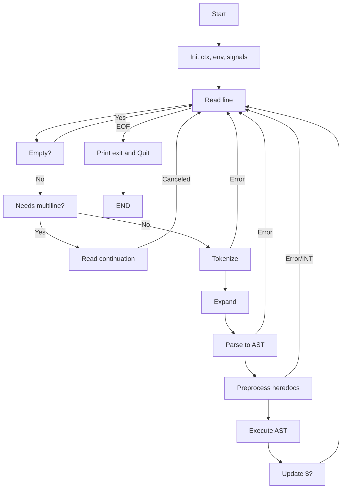

# Minishell — End-to-end Logic

This document describes the complete logic of the current Minishell implementation using concise pseudocode and diagrams. It’s organized by lifecycle phases and subsystems (input, tokenization, expansion, parsing, heredoc, execution, builtins, signals, cleanup). It focuses on behavior and control flow.

## Table of Contents

- Overview
- Process lifecycle
- Interactive loop
- Input acquisition and multiline support
- Tokenization
- Expansion (variables, status, pid, wildcards)
- Parsing and AST
- Heredoc preprocessing
- Execution engine
  - Simple commands and redirections
  - Pipelines
  - Logical operators (&& and ||)
- Builtins
- Signals and child status translation
- Errors and diagnostics
- Cleanup and resource management
- Edge cases and behavioral notes

---

## Overview

Minishell provides a minimal POSIX-like shell with:

- Interactive prompt with line editing (readline)
- Variable expansion (\$VAR, $?, $$), quoting rules, and wildcard expansion
- Redirections (<, >, >>, <<) and pipelines (|)
- Grouping with parentheses (...) when applicable
- Logical operators: AND (&&) and OR (||)
- Incomplete command lines and open quotes
- Core builtins: echo, cd, pwd, export, unset, env, exit
- Robust signal handling (Ctrl+C, Ctrl+\\) and heredoc behavior

The program keeps a shell context (exit status, environment copy, etc.), processes input lines, builds an AST, preprocesses heredocs, and executes according to the AST semantics.

---

## Process lifecycle

Summary of program startup and shutdown:

```pseudo
main(argv, envp):
  ctx := allocate_shell_context()
  ctx.env := copy_of(envp)
  update_shell_level_in(ctx.env)
  install_interactive_signal_handlers()

  exit_status := shell_loop(ctx)

  cleanup_shell_context(ctx)
  global_cleanup_once()  # history, global buffers, etc.
  return exit_status
```

Notes:
- Only one place clears readline history during final global cleanup.
- Interactive signal handlers are installed for the main loop; heredoc uses a different handler.

---

## Interactive loop

High-level control flow of the REPL:

```pseudo
shell_loop(ctx):
  while true:
    line := read_prompted_line()
    if line == NULL:               # EOF (Ctrl+D)
      print("exit")
      return ctx.exit_status

    if line_is_empty_or_spaces(line):
      continue

    if needs_multiline(line):
      line := read_and_concat_remaining_lines(line)
      if line == NULL:             # canceled or error
        ctx.exit_status := 130     # typical signal/interruption status
        continue

    tokens := tokenize(line)
    if tokens == NULL:
      ctx.exit_status := 2         # syntax/tokenization error
      continue

    expand(tokens, ctx)            # variables, status, pid, wildcards
    ast := parse(tokens)
    if ast == NULL:
      ctx.exit_status := 2         # syntax error
      free_tokens(tokens)
      continue

    if is_single_builtin_exit(ast):
      code := run_exit_builtin(ast, ctx)  # may terminate loop
      free_ast(ast); free_tokens(tokens)
      return code

    if preprocess_heredocs(ast, ctx) != OK:
      ctx.exit_status := 130 or 1  # depending on interruption or error
      free_ast(ast); free_tokens(tokens)
      continue

    status := execute_ast(ast, ctx)
    ctx.exit_status := status

    free_ast(ast)
    free_tokens(tokens)
```

---

## Input acquisition and multiline support

Handle quotes, unbalanced operators, and parenthesis to request more lines:

```pseudo
needs_multiline(line):
  state := scan_for_unclosed_quotes_or_trailing_operators(line)
  return state.requires_more_input

read_and_concat_remaining_lines(initial):
  buffer := initial
  while has_unclosed_construct(buffer):
    more := read_continuation_line()
    if more == NULL:           # EOF or canceled
      print_unexpected_eof_message()
      free(buffer)
      return NULL
    buffer := buffer + "\n" + more
  return buffer
```

Heredoc input is handled separately in the heredoc preprocessing (see below).

---

## Tokenization

Split the input into a linked sequence of tokens: words, operators, redirections, parentheses, and EOF.

```pseudo
tokenize(input):
  i := 0
  head := NULL
  tail := NULL
  while i < len(input):
    skip_spaces()
    if at_end(): break

    if starts_with_operator(input[i..]):
      tok := read_operator_token(input, &i)
    else:
      tok := read_word_token_respecting_quotes(input, &i)

    append_token(&head, &tail, tok)

  append_token(&head, &tail, EOF_TOKEN)
  return head
```

Operators include: `|`, `||`, `&&`, `<`, `>`, `>>`, `<<`, `(`, `)`.
Words preserve quoting context for later expansion decisions.

---

## Expansion (variables, status, pid, wildcards)

Expansion runs over WORD tokens, respecting quoting rules:

```pseudo
expand(tokens, ctx):
  for each token in tokens:
    if token.type != WORD: continue

    word := token.value
    quoted_ctx := analyze_quote_context(word)

    # 1) Variable/Status/PID expansion (quote-aware)
    if quoted_ctx.allows_parameter_expansion:
      word := expand_parameters(word, ctx)
      # handles $VAR, ${VAR}, $?, $$

    # 2) Field splitting (if applicable by design) — often skipped in minishell

    # 3) Wildcards (only when not single-quoted and unescaped)
    if quoted_ctx.allows_globbing and contains_unquoted_star(word):
      matches := glob_files(word)
      if matches not empty:
        replace_token_with_multiple_words(token, matches)
      else:
        keep_literal(word)
    else:
      token.value := word
```

Notes:
- Single quotes inhibit all expansions.
- Double quotes allow parameter expansion but usually prevent globbing.
- `$?` expands to last exit status; `$$` expands to current PID.

---

## Parsing and AST

The parser converts tokens into an Abstract Syntax Tree (AST) following precedence:

1. Parentheses group sub-expressions.
2. Redirections bind to the nearest simple command node.
3. Pipelines compose commands left-to-right.
4. Logical operators (&&, ||) compose pipelines left-to-right.

Simplified grammar (EBNF-like):

```text
logical_expr   := pipeline ( ("&&" | "||") pipeline )*
pipeline       := command ( "|" command )*
command        := (word | parenthesis | redirect)+
parenthesis    := "(" logical_expr ")"
redirect       := ("<" | ">" | ">>" | "<<") word
```

Parsing outline:

```pseudo
parse(tokens):
  parser := { current := tokens, error := 0 }
  ast := parse_logical_expr(parser)

  if parser.error:
    free_partial_ast(ast)
    return NULL

  if not at_EOF(parser):
    consume_until_EOF(parser)
    free_partial_ast(ast)
    return NULL

  return ast

parse_logical_expr(p):
  left := parse_pipeline(p)
  while peek(p) in {AND_AND, OR_OR}:
    op := advance(p)
    right := parse_pipeline(p)
    left := new_logic_node(op, left, right)
  return left

parse_pipeline(p):
  left := parse_command(p)
  while peek(p) == PIPE:
    advance(p)
    right := parse_command(p)
    left := new_pipe_node(left, right)
  return left

parse_command(p):
  node := new_simple_command()
  while token_is_word_or_redirect_or_parenthesis(peek(p)):
    if next_is_parenthesis:
      sub := parse_parenthesis(p)
      node := attach_subcommand(node, sub)
    else if next_is_redirect:
      r := parse_redirect(p)
      node := attach_redirect(node, r)
    else:
      w := consume_word(p)
      node := append_argument(node, w)
  validate_command(node)
  return node
```

Error handling marks `parser.error` on unexpected tokens or missing operands.

---

## Heredoc preprocessing

For each heredoc redirect (<< delimiter), collect content into a temporary file before execution. Each heredoc runs with dedicated signal handling.

```pseudo
preprocess_heredocs(ast, ctx):
  for each heredoc in ast (preorder traversal):
    filename := make_unique_heredoc_filename()
    pid := fork()
    if pid == 0:  # child
      install_heredoc_signal_handlers()
      content := read_lines_until(delimiter)
      if interrupted: exit(130)
      if error: exit(1)
      write_content_to(filename)
      exit(0)
    else:         # parent
      status := waitpid(pid)
      if status indicates signal or error:
        record_exit_status_from(status)  # usually 130 for SIGINT
        return ERROR
      replace_heredoc_redirect_with_input_file(heredoc, filename)
  return OK
```

Notes:
- On Ctrl+C during heredoc, the shell aborts current command preparation and returns to prompt with appropriate status.

---

## Execution engine

Execution is a recursive evaluation over the AST, respecting short-circuiting and setting the shell’s last exit status.

### Logical operators (&& and ||)

```pseudo
execute(ast, ctx):
  match ast.type:
    case LOGICAL_AND:
      left_status := execute(ast.left, ctx)
      if left_status == 0:
        return execute(ast.right, ctx)
      else:
        return left_status

    case LOGICAL_OR:
      left_status := execute(ast.left, ctx)
      if left_status != 0:
        return execute(ast.right, ctx)
      else:
        return 0

    case PIPELINE:
      return execute_pipeline(ast, ctx)

    case COMMAND:
      return execute_command(ast, ctx)

    case SUBSHELL:
      return execute_subshell(ast.sub, ctx)
```

### Simple commands and redirections

```pseudo
execute_command(cmd, ctx):
  redirects := collect_redirects_from(cmd)
  args := argv_from_command(cmd)
  if args is empty and redirects only:
    return apply_and_immediately_restore_redirects(redirects)

  if is_builtin(args[0]):
    if in_pipeline_or_subshell(cmd):
      return run_builtin_in_child(args, redirects, ctx)
    else:
      saved_fds := backup_stdio()
      if apply_redirects(redirects) != OK:
        restore_stdio(saved_fds)
        return 1
      status := run_builtin_in_parent(args, ctx)
      restore_stdio(saved_fds)
      return status

  # external command
  pid := fork()
  if pid == 0:  # child
    install_execution_signal_handlers()
    if apply_redirects(redirects) != OK: exit(1)
    execve(resolved_path(args[0], ctx.env), args, ctx.env)
    print_exec_error(args[0])
    exit(error_status_from_errno())
  else:
    return wait_and_translate_status(pid)
```

Redirections:

```pseudo
apply_redirects(list):
  for each r in list:
    open_mode := select_open_flags(r.type)
    fd := open(r.target, open_mode, 0644)
    if fd < 0:
      print_open_error(r.target)
      return ERROR
    if r.type is input-like:  dup2(fd, STDIN_FILENO)
    if r.type is output-like: dup2(fd, STDOUT_FILENO)
    close(fd)
  return OK
```

Path resolution:

```pseudo
resolved_path(cmd, env):
  if cmd contains '/':
    return cmd
  path_dirs := split(env["PATH"], ':') if exists else []
  for dir in path_dirs:
    candidate := join(dir, cmd)
    if is_executable_file(candidate):
      return candidate
  return NULL  # triggers "command not found"
```

### Pipelines

```pseudo
execute_pipeline(pipe_node, ctx):
  n := number_of_commands(pipe_node)
  pipes := create_n_minus_1_pipes(n)
  pids := []

  for i in 0..n-1:
    pid := fork()
    if pid == 0:  # child
      install_execution_signal_handlers()
      if i > 0:       dup2(pipes[i-1].read, STDIN)
      if i < n-1:     dup2(pipes[i].write, STDOUT)
      close_all_pipes_in_child(pipes)
      status := execute_command_or_subnode_in_child(i)
      exit(status)
    else:
      pids.append(pid)

  close_all_pipes_in_parent(pipes)
  return wait_for_all(pids)  # translate last command’s status, print signals
```

The returned status of a pipeline is the exit status of the last command (as in Bash).

---

## Builtins

Behavior overview; exact details depend on your project rules.

```pseudo
is_builtin(name):
  return name in { "echo", "cd", "pwd", "export", "unset", "env", "exit" }

run_builtin_in_parent(argv, ctx):
  match argv[0]:
    case "echo":  return echo_implementation(argv[1..])
    case "cd":    return cd_implementation(argv[1..], ctx)
    case "pwd":   return pwd_implementation()
    case "export":return export_implementation(argv[1..], ctx)
    case "unset": return unset_implementation(argv[1..], ctx)
    case "env":   return env_implementation(ctx)
    case "exit":  return exit_implementation(argv[1..], ctx)  # may end shell
```

Key notes:
- `cd`, `export`, `unset`, and `exit` must affect the parent shell; they run without forking unless part of a pipeline or subshell.
- `echo -n` may accept multiple `-n` flags.
- `export` with no args prints sorted environment (format `declare -x NAME="VALUE"`).
- `exit` parses numeric argument, handles errors (numeric argument required, too many arguments).

---

## Signals and child status translation

Interactive mode:

```pseudo
install_interactive_signal_handlers():
  on SIGINT: interrupt current readline, print newline, reset prompt state
  on SIGQUIT: ignore (no core dump)
```

Heredoc mode uses a different SIGINT handler to abort collection with status 130.

Child status interpretation after `waitpid`:

```pseudo
translate_status(status):
  if WIFEXITED(status):
    return WEXITSTATUS(status)
  if WIFSIGNALED(status):
    sig := WTERMSIG(status)
    maybe_print_signal_message(sig)   # e.g., newline for SIGINT, "Quit: 3" for SIGQUIT
    return 128 + sig
```

For pipelines, collect all children; the returned status is derived from the last command’s status. Signals may produce user-visible messages once.

---

## Errors and diagnostics

Typical user-facing error messages (prefix with shell name as needed):

- Syntax errors: `syntax error near unexpected token 'X'`
- Redirection errors: `No such file or directory`, `Permission denied`
- Command resolution: `command not found`, `is a directory`, `Permission denied`
- Builtin `exit`: `numeric argument required`, `too many arguments`
- Environment validation: `not a valid identifier`

Parsing failures or leftover tokens cause the parser to free any partial AST and return NULL, setting an appropriate exit status (commonly 2 for syntax errors).

---

## Cleanup and resource management

Memory and descriptor hygiene is crucial to avoid leaks in loops:

```pseudo
cleanup_shell_context(ctx):
  free(ctx.env)
  free(other_allocations)

global_cleanup_once():
  clear_readline_history()
  release_global_buffers()

per-iteration cleanup:
  free(line)
  free_tokens(tokens)
  free_ast(ast)
  close_heredoc_temp_files()
```

When running builtins in the parent, always backup and restore stdio around redirections.

---

## Edge cases and behavioral notes

- Empty input or only spaces: no-op, status unchanged.
- Only redirections without a command: open/dup/close semantics apply; then return.
- Quoting rules:
  - Single quotes: literal, no expansions.
  - Double quotes: parameter expansion allowed; wildcard expansion typically not.
- PATH absent: only absolute/relative paths with `/` are executed; others error as `command not found`.
- Wildcards that match nothing: left as literal (Bash-compatible behavior may vary by project rules).
- Heredoc delimiter quoting: quoted delimiter disables parameter expansion in heredoc content.
- Logical operators short-circuit: right side might never execute.
- Exit status propagation: the last executed command’s status is kept in the shell context and used for `$?`.

---

## High-level flow



---

This guide covers the full logical path of the minishell implementation without referencing specific source code. It can be used to validate behavior, onboard contributors, and ensure feature parity after refactors.

---

## Macros externas usadas en minishell

### 1. Señales y manejo de procesos (`signal.h`, `sys/wait.h`)

| Macro                | Librería         | Descripción                                                                 |
|----------------------|------------------|-----------------------------------------------------------------------------|
| SIGINT               | `<signal.h>`     | Señal de interrupción (Ctrl+C)                                              |
| SIGQUIT              | `<signal.h>`     | Señal de salida forzada (Ctrl+\)                                           |
| SIGTSTP              | `<signal.h>`     | Señal para parar proceso (Ctrl+Z)                                           |
| WIFEXITED(status)    | `<sys/wait.h>`   | Verdadero si el hijo terminó normalmente                                    |
| WEXITSTATUS(status)  | `<sys/wait.h>`   | Código de salida del hijo si terminó normalmente                            |
| WIFSIGNALED(status)  | `<sys/wait.h>`   | Verdadero si el hijo terminó por una señal                                  |
| WTERMSIG(status)     | `<sys/wait.h>`   | Número de la señal que terminó el proceso hijo                              |

### 2. Entrada/Salida y archivos (`unistd.h`, `fcntl.h`)

| Macro                | Librería         | Descripción                                                                 |
|----------------------|------------------|-----------------------------------------------------------------------------|
| STDIN_FILENO         | `<unistd.h>`     | Descriptor estándar de entrada (0)                                          |
| STDOUT_FILENO        | `<unistd.h>`     | Descriptor estándar de salida (1)                                           |
| STDERR_FILENO        | `<unistd.h>`     | Descriptor estándar de error (2)                                            |
| O_RDONLY             | `<fcntl.h>`      | Abrir archivo solo lectura                                                  |
| O_WRONLY             | `<fcntl.h>`      | Abrir archivo solo escritura                                                |
| O_CREAT              | `<fcntl.h>`      | Crear archivo si no existe                                                  |
| O_TRUNC              | `<fcntl.h>`      | Truncar archivo a cero                                                      |
| O_APPEND             | `<fcntl.h>`      | Añadir al final del archivo                                                 |

### 3. Otros

| Macro                | Librería         | Descripción                                                                 |
|----------------------|------------------|-----------------------------------------------------------------------------|
| NULL                 | `<stddef.h>`/`<stdlib.h>` | Puntero nulo                                                      |
| EXIT_SUCCESS         | `<stdlib.h>`     | Código estándar de éxito (0)                                                |
| EXIT_FAILURE         | `<stdlib.h>`     | Código estándar de error (1)                                                |
